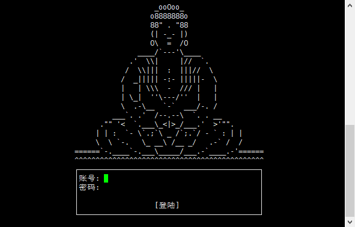

# 云顶修仙命令行版本

浏览器版本地址：http://yundingxx.com:3344


## 初始化

```bash
# 克隆代码
git clone git@github.com:hanhan-GKD/ydxx-terminal.git
cd yundingxx-terminal

# 温馨提示 python >= 3.6 为最佳

# 如果没有 python3 环境请自行安装
centos7 及以上:yum install python36
centos6系列的版本也许可能大概会出现无法直接安装 python3 的问题,请自行源码安装.步骤复杂在此不多赘述,请自行百度。
ubuntu:apt-get install python3.6

# 环境安装（建议虚拟环境安装）
pip3 install -r requirements.txt

# PS: 目前暂时还只能在 mac/linux 上使用命令行,windows上无法运行，暂待解决。
